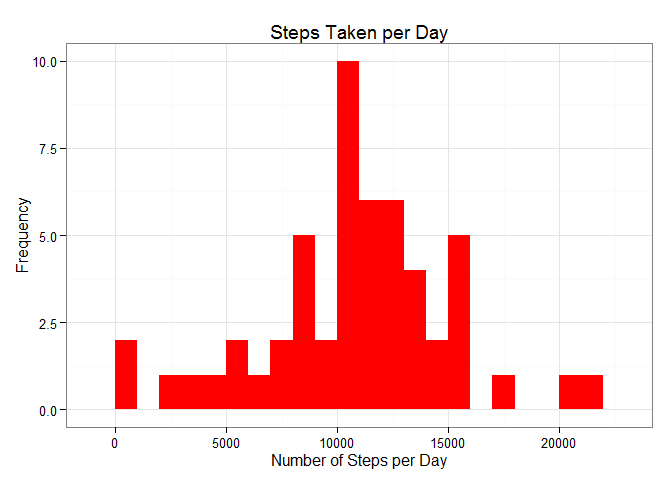
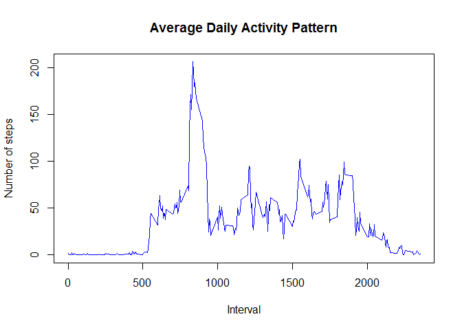
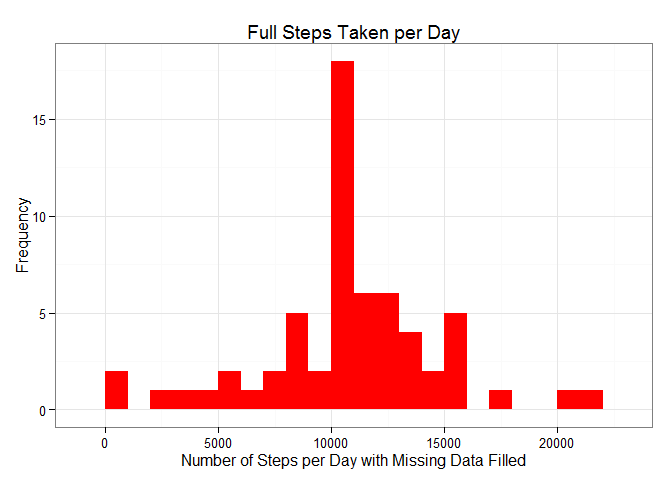
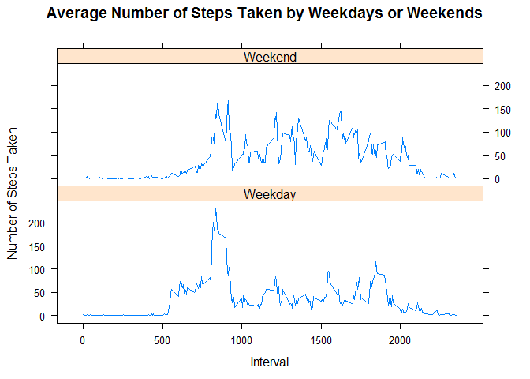

# Reproducible Research: Peer Assessment 1

## Loading and preprocessing the data

**Note:** It is assumed that the file activity.csv is in the current working directory. 

```r
if (!file.exists("activity.csv")) {
    unzip("repdata-data-activity.zip")
}
activity <- read.csv("activity.csv")
```


```r
#Convert the data format

activity$date <- as.Date(activity$date, format = "%Y-%m-%d")
```

## What is mean total number of steps taken per day?

1. Calculate the total no of steps taken per day

```r
steps_taken_per_day <- aggregate(steps ~ date, activity, sum)
colnames(steps_taken_per_day) <- c("date", "steps")
```

2. Plot a histogram of the total number of steps taken per day 

```r
library(ggplot2)
ggplot(steps_taken_per_day, aes(x = steps)) + 
       geom_histogram(fill = "red", binwidth = 1000) + 
        labs(title="Steps Taken per Day", 
             x = "Number of Steps per Day", y = "Frequency") + 
        theme_bw() 
```

 

3. Calculate and report the mean and median of the total number of steps taken per day

```r
steps_mean   <- mean(steps_taken_per_day$steps, na.rm=TRUE)
steps_median <- median(steps_taken_per_day$steps, na.rm=TRUE)
```
* The mean is 10766.19 and median is 10765.


## What is the average daily activity pattern?

1. Make a time series plot (i.e. type = "l") of the 5-minute interval (x-axis) and the average number of steps taken, averaged across all days (y-axis)

```r
steps_taken_per_interval <- aggregate(steps~interval, activity,
                                FUN=mean, na.rm=TRUE)

colnames(steps_taken_per_interval) <- c("interval", "steps")
 
plot(steps_taken_per_interval, type="l",main="Average Daily Activity Pattern", xlab="Interval", ylab="Number of steps", col="blue")
```

 

2. Which 5-minute interval, on average across all the days in the dataset, contains the maximum number of steps?

```r
max_step_interval <- steps_taken_per_interval[which.max(  
        steps_taken_per_interval$steps),]
```
* The 835<sup>th</sup> has the maximum number of steps: 206.17.

## Imputing missing values
1. Calculate and report the total number of missing values in the dataset (i.e. the total number of rows with NAs)

```r
missing <- sum(is.na(activity))
```
* Total number of missing vlues in the dataset is 2304.

2. Devise a strategy for filling in all of the missing values in the dataset. The strategy does not need to be sophisticated. For example, you could use the mean/median for that day, or the mean for that 5-minute interval, etc.

* I will use the means for the 5-minute intervals as fillers for missing
values.

3. Create a new dataset that is equal to the original dataset but with the missing data filled in.

```r
activity_fill <- merge(activity, steps_taken_per_interval, by="interval", suffixes=c("",".mean"))
nasteps <- is.na(activity_fill$steps)
activity_fill$steps[nasteps] <- activity_fill$steps.mean[nasteps]
activity_fill <- activity_fill[,c(1:3)]
```

4. Make a histogram of the total number of steps taken each day and Calculate and report the mean and median total number of steps taken per day. Do these values differ from the estimates from the first part of the assignment? What is the impact of imputing missing data on the estimates of the total daily number of steps?


```r
steps_per_day_fill <- aggregate(steps ~ date, activity_fill, sum)
colnames(steps_per_day_fill) <- c("date", "steps")

ggplot(steps_per_day_fill, aes(x = steps)) + 
       geom_histogram(fill = "red", binwidth = 1000) + 
        labs(title="Full Steps Taken per Day", 
             x = "Number of Steps per Day with Missing Data Filled", y = "Frequency") + 
        theme_bw() 
```

 

```r
steps_mean_fill   <- mean(steps_per_day_fill$steps, na.rm=TRUE)
steps_median_fill <- median(steps_per_day_fill$steps, na.rm=TRUE)
```
* The mean before is 10766.19 and median is 10765.  The mean now is 10766.19 and median is 10766.19.
* While the mean value remains unchanged, the median value has shifted and virtual matches to the mean.
* It seems that the impact of imputing missing values has increase the peak value, but it's not impact the predictions.


## Are there differences in activity patterns between weekdays and weekends?
1. Create a new factor variable in the dataset with two levels - "weekday" and "weekend" indicating whether a given date is a weekday or weekend day.


```r
weekdays <- c("Monday", "Tuesday", "Wednesday", "Thursday", 
              "Friday")
activity_fill$daytype = as.factor(ifelse(is.element(weekdays(as.Date(activity_fill$date)),weekdays), "Weekday", "Weekend"))
```


2. Make a panel plot containing a time series plot (i.e. type = "l") of the 5-minute interval (x-axis) and the average number of steps taken, averaged across all weekday days or weekend days (y-axis). See the README file in the GitHub repository to see an example of what this plot should look like using simulated data.


```r
steps_per_interval <- aggregate(data=activity_fill, 
                                steps ~ daytype + interval,
                                FUN=mean)
library("lattice")

xyplot(type = 'l', steps_per_interval$steps ~ steps_per_interval$interval | steps_per_interval$daytype, 
       main="Average Number of Steps Taken by Weekdays or Weekends",
       xlab="Interval",
       ylab="Number of Steps Taken", layout=c(1,2))
```

 

